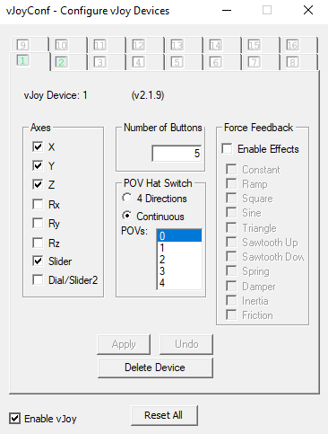
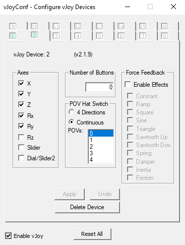
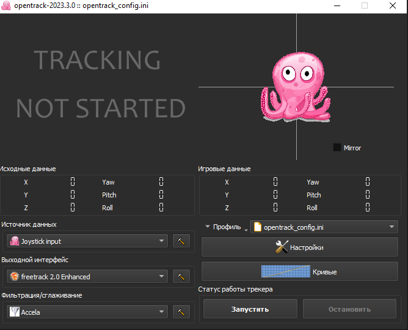
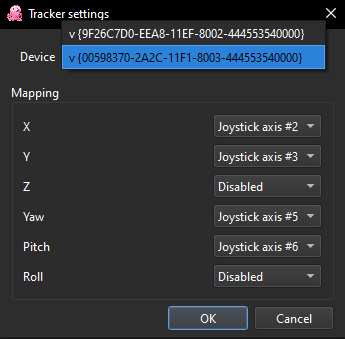
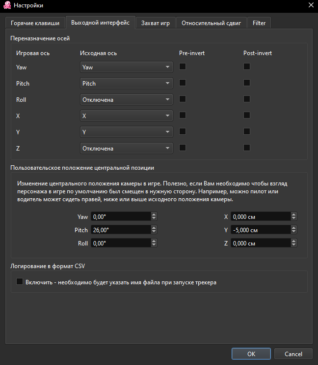
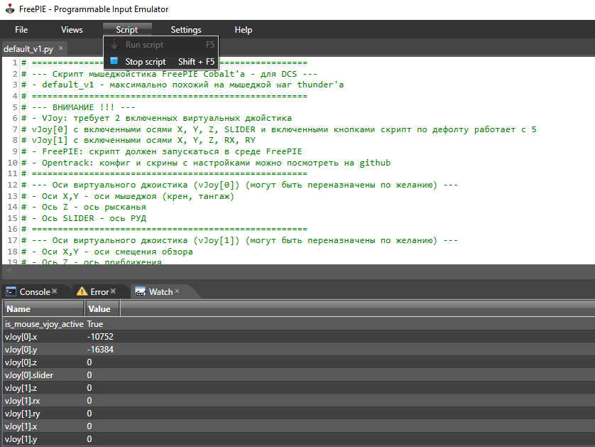

# Cкрипт для [FreePIE](https://github.com/AndersMalmgren/FreePIE/releases) (программируемый имулятор ввода)

Скрипт использует виртуальный джойстик [vJoy](https://github.com/jshafer817/vJoy/releases) и [OpenTrack](https://github.com/opentrack/opentrack/releases) для обзора

# Настройка для vJoy
Скрипт требует требует 2 включеных виртуальных джойстика VJoy
vJoy[0] с включенными осями X, Y, Z, SLIDER и включенными кнопками скрипт по дефолту работает с 5
vJoy[1] с включенными осями X, Y, Z, RX, RY

# Настройка для OpenTrack

Нужно выставить Joystick input и выбрать opentrack_config.ini из репозитория

Либо можно в ручную выставить следующие настройки

OpenTrack > Источник данных, выставить показанные оси, 2-го джостика VJoy
X > Joystick axis 2
Y > Joystick axis 3
Yaw > Joystick axis 5
Pitch > Joystick axis 6

OpenTrack > Настройки > Настройки выходного интерфейса
Включить оси
X > X
Y > Y
Yaw > Yaw
Pitch > Pitch
Остальные отключены

Настроить центральное положение камеры ниже

# Запуск скрипта в FreePIE

Нужно открыть скрипт из репозитория в FreePIE и запустить его в вкладке script -> run script

# Используемые клавиши управления (могут быть переназначены по желанию)
### У разных конфигом могут быть свои небольшие отличия и могут быть свои дополнительные клавиши перечисленные актуальны для default_v1
- TAB - принудительное выключение мышеджоя (его оси переходят на обзор)
- Home - переключение блокировки ввода (мышеджой должен быть выключен)
- F10 - блокирует любой ввода, может быть разблокирован клавиатурный ввод клавишами: Home, F1
- F1 - разблокирует клавиатурный ввод в случаи если ввод был заблокирован клавишей F10
- RightShift - центрирование взгляда
- C - включает мышеджой и центрирует обзор на прицел, удержание кнопку включает обзор
- W, S - тяга
- A, D - крен по клавиатуре на максимальное значение
- LeftCtrl, LeftShift - тангаж по клавиатуре на максимальное значение
- Q, E - рысканье по клавиатуре на максимальное значение
- 1, 2, 3, 4, 5 - перемещение обзора в определенную точку без выключения мышеджоя: вверх, вниз, вправо, влево, назад
- 6, 7, 8, 9 - смещение обзора по кабине: верх, вниз, вправо, влево