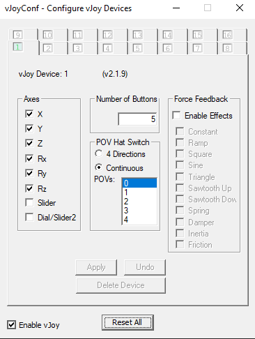

# Cкрипт для [FreePIE](https://github.com/AndersMalmgren/FreePIE/releases) (програмируемый имулятор ввода)

Скрипт использует виртуальный джостик [vJoy](https://sourceforge.net/projects/vjoystick/) и [Opentrack](https://github.com/opentrack/opentrack/releases) для обзора

# Настройка для vJoy

# Настройка для OpenTrack

Нужно выставить Joystick input и выбрать opentrack_config.ini из репозитория

# Запуск скрипта в FreePIE

Нужно открыть скрипт из репозитория в FreePIE и запустить его в вкладке script -> run script

# --- Используемые клавиши управления (могут быть переназначены по желанию) ---
- TAB - принудительное выключение мышеджоя
- C включает мышеджой и центрирует обзор на прицел, удержание кнопку включает обзор
- A,D - перемещение положение мышеджоя по крену на MAX_MOUSE_JOY_VALUE/2 относительного текущего положение мышеджоя
- LeftCtrl, LeftShift - перемещение положение мышеджоя по тангажу на MAX_MOUSE_JOY_VALUE/2 относительного текущего положение мышеджоя
- Enter - Центрирование обзора, Opentrack желательно включать после центрироваия обзора для правильной его работы
- Колесико мыши - центрирование курсора/мышеджойстика